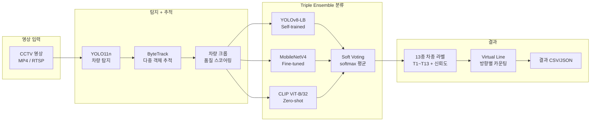

# CCTV Vehicle Classifier

> CCTV 영상에서 한국도로공사 13종 차종을 자동 분류하는 Triple Ensemble 파이프라인 (CPU 전용, 358 crops/sec)


## Overview

CCTV 영상 프레임에서 차량을 탐지(YOLO)하고, 크롭된 이미지를 Triple Ensemble(YOLOv8-Large Backbone + MobileNetV4 + CLIP zero-shot)으로 13종 차종(T1~T13)으로 분류하는 파이프라인이다. 147K장 자동 라벨링 + 수동 검수 루프로 학습 데이터를 구축했으며, CPU 환경에서 358 crops/sec 처리 속도를 달성했다. 한국도로공사 교통량조사 차종 체계(승용차~이륜차 13종)를 기준으로 분류한다.

## Tech Stack

| 영역 | 기술 |
|------|------|
| 탐지 | YOLO11n (Ultralytics) |
| 추적 | ByteTrack (supervision) |
| 분류 백본 1 | YOLOv8-Large Backbone (self-training) |
| 분류 백본 2 | MobileNetV4 (timm) |
| 분류 백본 3 | CLIP ViT-B/32 (zero-shot) |
| 앙상블 | Soft-voting (softmax 평균) |
| 라벨링 | CLIP 클러스터링 + KNN 검증 + 수동 검수 |
| Runtime | PyTorch, OpenCV, NumPy (CPU only) |

## Architecture



## Key Features

- **Triple Ensemble** -- 3개 백본 soft-voting으로 단일 모델 대비 +8~10%p 정확도 향상
- **147K 자동 라벨링** -- CLIP 임베딩 클러스터링 -> KNN 교차 검증 -> Confident Learning -> 수동 보정 4단계
- **CPU 최적화** -- GPU 없이 358 crops/sec 달성 (PyTorch CPU)
- **Self-training 루프** -- 고신뢰 예측으로 재학습 -> 홀드아웃 검증 -> 중단조건 자동 판정
- **Virtual Line 카운팅** -- 방향별 통과 차량 카운트, 차종별 교통량 집계
- **13종 차종 체계** -- 한국도로공사 표준 (T1 승용차 ~ T13 이륜차, 차축/단위수 기반)

## Getting Started

```bash
pip install -r requirements.txt
python src/demo_single_video.py --video /path/to/video.mp4
# 전체 배치: python src/batch_all_ic.py --input_dir /path/to/videos/
```

## Project Structure

```
pipeline/
├── src/
│   ├── detector.py              # YOLO11n 차량 탐지
│   ├── tracker.py               # ByteTrack 다중 객체 추적
│   ├── ensemble_classifier.py   # Triple Ensemble 분류기
│   ├── video_consistency.py     # Virtual Line + Lazy 분류 통합
│   ├── config.py                # 경로, 상수, 모델 설정
│   ├── train_mnv4_full.py       # MobileNetV4 학습
│   ├── eval_holdout.py          # 홀드아웃 검증 (중단조건)
│   ├── claude_label_runner.py   # Claude API 라벨링
│   └── crop_review_web.py       # 라벨 검수 웹 UI
├── data/models/                 # 학습된 가중치 (.pt)
├── docs/                        # 분석 보고서, 방법론
└── requirements.txt
```

## Technical Decisions

- **Triple Ensemble 채택**: 단일 백본 정확도 50~55%에서 3-backbone soft-voting으로 60%+ 달성. 특히 T4(중형화물)와 T5(대형화물) 혼동이 -15%p 감소. 속도 페널티 대비 정확도 이득이 명확했다.
- **CLIP zero-shot 포함**: 학습 데이터가 부족한 T7(5축), T11(풀트레일러) 등 희소 클래스에서 CLIP의 텍스트-이미지 매칭이 나머지 백본의 약점을 보완한다. 3번째 투표자 역할로 오분류를 교정한다.
- **Self-training 중단조건**: 홀드아웃 3,352장에서 F1 하락 2회 연속, 또는 전체 변경 비율 1% 미만 시 자동 종료. 과적합 방지와 수렴 보장을 동시에 달성했다.
